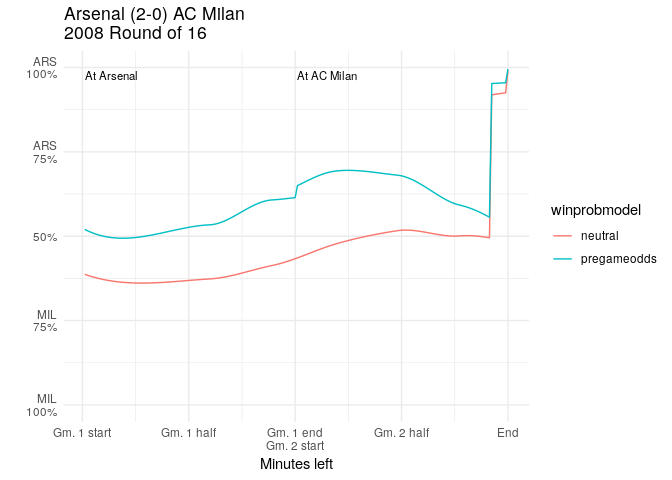

``` r
library(tidyverse)
```

    ## ── Attaching packages ────────────────────────────────────────────────────────────────────────────────────────── tidyverse 1.2.1 ──

    ## ✔ ggplot2 3.0.0     ✔ purrr   0.2.5
    ## ✔ tibble  1.4.2     ✔ dplyr   0.7.6
    ## ✔ tidyr   0.8.1     ✔ stringr 1.3.1
    ## ✔ readr   1.1.1     ✔ forcats 0.3.0

    ## ── Conflicts ───────────────────────────────────────────────────────────────────────────────────────────── tidyverse_conflicts() ──
    ## ✖ dplyr::filter() masks stats::filter()
    ## ✖ dplyr::lag()    masks stats::lag()

``` r
winprob = read_csv('analysis/winprob-model.csv')
```

    ## Parsed with column specification:
    ## cols(
    ##   season = col_integer(),
    ##   round = col_character(),
    ##   tie = col_character(),
    ##   t1win = col_integer(),
    ##   made_minute = col_integer(),
    ##   away = col_character(),
    ##   t1goaldiff = col_integer(),
    ##   t1awaygoaldiff = col_integer(),
    ##   neutral = col_double(),
    ##   pregameodds = col_double()
    ## )

``` r
teamnames = read_delim('raw/teamcrosswalk.psv', delim = '|')
```

    ## Parsed with column specification:
    ## cols(
    ##   fullteam = col_character(),
    ##   teamcode = col_character(),
    ##   country = col_character(),
    ##   shortcode = col_character()
    ## )

``` r
results = read_csv('processed/results.csv')
```

    ## Parsed with column specification:
    ## cols(
    ##   season = col_integer(),
    ##   round = col_character(),
    ##   tie = col_character(),
    ##   winner = col_character(),
    ##   pk = col_character(),
    ##   agr = col_character(),
    ##   aet = col_character(),
    ##   result = col_character()
    ## )

``` r
plot_winprob = function(slug) {
  pieces = str_split(slug, pattern = '\\|')
  y = pieces[[1]][1]
  r = pieces[[1]][2]
  t = pieces[[1]][3]
  t1 = str_split(t, pattern='-')[[1]][1]
  t2 = str_split(t, pattern='-')[[1]][2]
  t1full = teamnames %>% filter(teamcode == t1) %>% pull(fullteam)
  t2full = teamnames %>% filter(teamcode == t2) %>% pull(fullteam)
  t1code = teamnames %>% filter(teamcode == t1) %>% pull(shortcode)
  t2code = teamnames %>% filter(teamcode == t2) %>% pull(shortcode)
  result = results %>% 
    filter(season == y) %>% 
    filter(round == r) %>% 
    filter(tie == t) %>% 
    pull(result)
  title = str_c(
    result,'\n',
    y, ' ',
    case_when(
      r == 'first' ~ 'Round of 16',
      r == 'qtr' ~ 'Quarterfinal',
      r == 'semi' ~ 'Semifinal',
      TRUE ~ ''
    )
  )
  winprob %>% 
    filter(season == y) %>% 
    filter(round == r) %>% 
    filter(tie == t) %>% 
    gather(key = winprobmodel, value = winprob, neutral, pregameodds) %>% 
    ggplot(aes(made_minute, winprob, color=winprobmodel)) +
    geom_line() +
    scale_y_continuous(
      limits = c(0,1),
      breaks = c(0.0,0.25,0.5,0.75,1.0),
      labels = c(
        str_c(t2code, '\n100%'),
        str_c(t2code, '\n75%'),
        '50%',
        str_c(t1code, '\n75%'),
        str_c(t1code, '\n100%')
      )
    ) +
    scale_x_continuous(
      breaks = c(0, 46, 92, 138, 184),
      labels = c('Gm. 1 start','Gm. 1 half','Gm. 1 end\nGm. 2 start','Gm. 2 half','End')
    ) +
    theme_minimal() +
    annotate('text', x = 1, y = 0.975, label = str_c('At ', t1full), size = 3, hjust = 0) +
    annotate('text', x = 93, y = 0.975, label = str_c('At ', t2full), size = 3, hjust = 0) +
    xlab("Minutes left") +
    ylab("") +
    ggtitle(title)
}
```

``` r
plot_winprob('2008|first|arsenal-milan')
```



``` r
for (i in 1:nrow(results)) {
  slug = str_c(
    results[i,]$season[1], '|',
    results[i,]$round[1], '|',
    results[i,]$tie[1]
  )
  p = plot_winprob(slug)
  ggsave(str_c('analysis/plots/',slug,'.png'), plot = p, width = 11, height = 8.5, units = "in")
}
```
