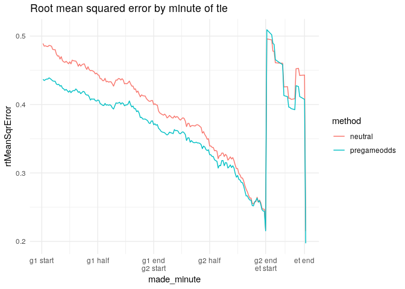
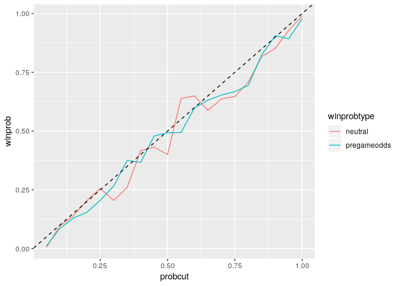
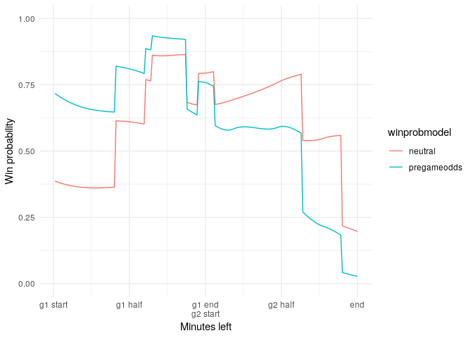

``` r
library(locfit)
```

    ## locfit 1.5-9.1    2013-03-22

``` r
library(tidyverse)
```

    ## ── Attaching packages ─────────────────────────────────────── tidyverse 1.2.1 ──

    ## ✔ ggplot2 3.0.0     ✔ purrr   0.2.5
    ## ✔ tibble  1.4.2     ✔ dplyr   0.7.6
    ## ✔ tidyr   0.8.1     ✔ stringr 1.3.1
    ## ✔ readr   1.1.1     ✔ forcats 0.3.0

    ## ── Conflicts ────────────────────────────────────────── tidyverse_conflicts() ──
    ## ✖ dplyr::filter() masks stats::filter()
    ## ✖ dplyr::lag()    masks stats::lag()

``` r
results = read_csv('processed/results.csv')
```

    ## Parsed with column specification:
    ## cols(
    ##   season = col_integer(),
    ##   round = col_character(),
    ##   tie = col_character(),
    ##   winner = col_character(),
    ##   pk = col_character(),
    ##   agr = col_character(),
    ##   aet = col_character(),
    ##   result = col_character()
    ## )

``` r
matrix  = read_csv('processed/minute-matrix.csv')
```

    ## Parsed with column specification:
    ## cols(
    ##   .default = col_integer(),
    ##   round = col_character(),
    ##   tie = col_character(),
    ##   made_minute = col_double(),
    ##   away = col_character(),
    ##   t1 = col_character(),
    ##   t2 = col_character(),
    ##   winner = col_character(),
    ##   pcthomeg1 = col_double(),
    ##   pctdrawg1 = col_double(),
    ##   pctawayg1 = col_double(),
    ##   pcthomeg2 = col_double(),
    ##   pctdrawg2 = col_double(),
    ##   pctawayg2 = col_double()
    ## )

    ## See spec(...) for full column specifications.

``` r
head(matrix)
```

    ## # A tibble: 6 x 21
    ##   season round tie   made_minute away   game t1goaldiff t1awaygoaldiff
    ##    <int> <chr> <chr>       <dbl> <chr> <int>      <int>          <int>
    ## 1   2008 first arse…           1 <NA>      1          0              0
    ## 2   2008 first arse…           2 <NA>      1          0              0
    ## 3   2008 first arse…           3 <NA>      1          0              0
    ## 4   2008 first arse…           4 <NA>      1          0              0
    ## 5   2008 first arse…           5 <NA>      1          0              0
    ## 6   2008 first arse…           6 <NA>      1          0              0
    ## # ... with 13 more variables: t1home <int>, stoppagetime <int>,
    ## #   extratime <int>, t1 <chr>, t2 <chr>, winner <chr>, t1win <int>,
    ## #   pcthomeg1 <dbl>, pctdrawg1 <dbl>, pctawayg1 <dbl>, pcthomeg2 <dbl>,
    ## #   pctdrawg2 <dbl>, pctawayg2 <dbl>

``` r
tail(matrix)
```

    ## # A tibble: 6 x 21
    ##   season round tie   made_minute away   game t1goaldiff t1awaygoaldiff
    ##    <int> <chr> <chr>       <dbl> <chr> <int>      <int>          <int>
    ## 1   2019 first unit…         179 <NA>      2         -1              0
    ## 2   2019 first unit…         180 <NA>      2         -1              0
    ## 3   2019 first unit…         181 <NA>      2         -1              0
    ## 4   2019 first unit…         182 <NA>      2         -1              0
    ## 5   2019 first unit…         183 <NA>      2         -1              0
    ## 6   2019 first unit…         184 a         2          0              1
    ## # ... with 13 more variables: t1home <int>, stoppagetime <int>,
    ## #   extratime <int>, t1 <chr>, t2 <chr>, winner <chr>, t1win <int>,
    ## #   pcthomeg1 <dbl>, pctdrawg1 <dbl>, pctawayg1 <dbl>, pcthomeg2 <dbl>,
    ## #   pctdrawg2 <dbl>, pctawayg2 <dbl>

``` r
model.neutral = locfit(
  t1win ~ made_minute + t1goaldiff + t1awaygoaldiff,
  data = matrix,
  family = 'binomial'
)
```

``` r
model.pregameodds = locfit(
  t1win ~ made_minute + t1goaldiff + t1awaygoaldiff + 
    pcthomeg1 + pcthomeg2,
  data = matrix,
  family = 'binomial'
)
```

``` r
winprob = matrix %>% 
  mutate(
    neutral = predict(model.neutral, newdata = ., type = "response"),
    pregameodds = predict(model.pregameodds, newdata = ., type = "response")
  ) %>% 
  select(season, round, tie, t1win, made_minute, away, t1goaldiff, t1awaygoaldiff, neutral, pregameodds)
```

``` r
errors = winprob %>% 
  mutate(
    errorN = t1win - neutral, errorO = t1win - pregameodds,
    sqrErrorN = errorN^2, sqrErrorO = errorO^2
  ) %>% 
  group_by(made_minute) %>% 
  summarise(
    count = n(),
    neutral = sqrt(mean(sqrErrorN)),
    pregameodds = sqrt(mean(sqrErrorO))
  )

errors %>% 
  select(-count) %>% 
  gather(key = method, value = rtMeanSqrError, neutral, pregameodds) %>% 
  ggplot() +
  geom_line(aes(x = made_minute, y = rtMeanSqrError, color = method)) +
  ggtitle('Root mean squared error by minute of tie') +
  scale_x_continuous(
    breaks = c(0, 46, 92, 138, 184, 216),
    labels = c('g1 start','g1 half','g1 end\ng2 start','g2 half','g2 end\net start','et end')
  ) +
  theme_minimal()
```



``` r
proberrorN = winprob %>% 
  select(made_minute, pregameodds, t1win) %>% 
  mutate(probrange = cut_interval(pregameodds, 20)) %>% 
  group_by(probrange) %>% 
  summarise(actualprob = sum(t1win) / n()) %>% 
  mutate(
    probcut = probrange %>% 
      as.character() %>% 
      str_extract(",.*]") %>% 
      str_sub(start = 2, end = -2) %>% 
      as.numeric()
  )

proberrorO = winprob %>% 
  select(made_minute, neutral, t1win) %>% 
  mutate(probrange = cut_interval(neutral, 20)) %>% 
  group_by(probrange) %>% 
  summarise(actualprob = sum(t1win) / n()) %>% 
  mutate(
    probcut = probrange %>% 
      as.character() %>% 
      str_extract(",.*]") %>% 
      str_sub(start = 2, end = -2) %>% 
      as.numeric()
  )

proberrorN %>% 
  select(probcut, actualprob) %>% 
  left_join(
    proberrorO %>% 
      select(actualprob, probcut),
    by = 'probcut',
    suffix = c('.neutral','.pregameodds')
  ) %>% 
  gather(key = winprobtype, value = winprob, actualprob.neutral, actualprob.pregameodds) %>% 
  mutate(winprobtype = str_replace(winprobtype, 'actualprob.', '')) %>% 
  ggplot() +
  geom_line(aes(probcut, winprob, color = winprobtype)) +
  geom_abline(slope = 1, intercept = 0, linetype = "dashed")
```



``` r
winprob %>% 
  group_by(season, round, tie, made_minute) %>%
  count() %>%
  filter(n > 1)
```

    ## # A tibble: 4 x 5
    ## # Groups:   season, round, tie, made_minute [4]
    ##   season round tie             made_minute     n
    ##    <int> <chr> <chr>                 <dbl> <int>
    ## 1   2012 first marseille-inter         184     2
    ## 2   2013 qtr   malaga-dortmund         184     2
    ## 3   2015 first arsenal-monaco           92     2
    ## 4   2017 first psg-barcelona           184     2

``` r
winprob %>% 
  group_by(season, round, tie) %>% 
  mutate(wpdiff = abs(pregameodds - lag(pregameodds))) %>% 
  drop_na(away) %>% 
  arrange(-wpdiff) %>% 
  head(30) %>% 
  select(season, round, tie, made_minute, t1win, away, wpdiff)
```

    ## # A tibble: 30 x 7
    ## # Groups:   season, round, tie [28]
    ##    season round tie                made_minute t1win away  wpdiff
    ##     <int> <chr> <chr>                    <dbl> <int> <chr>  <dbl>
    ##  1   2009 semi  barcelona-chelsea          184     1 a      0.675
    ##  2   2012 first marseille-inter            184     1 a      0.636
    ##  3   2009 first arsenal-roma               217     1 a      0.618
    ##  4   2010 first bayern-fiorentina          153     1 a      0.590
    ##  5   2018 first juventus-tottenham         160     1 a      0.583
    ##  6   2019 first united-psg                 184     1 a      0.576
    ##  7   2017 qtr   bayern-madrid              151     0 a      0.575
    ##  8   2013 first madrid-united              159     1 a      0.574
    ##  9   2015 first psg-chelsea                209     0 a      0.573
    ## 10   2008 semi  liverpool-chelsea          157     0 a      0.557
    ## # ... with 20 more rows

``` r
y = 2018
r = 'qtr'
t = 'barcelona-roma'

winprob %>% 
  filter(season == y) %>% 
  filter(round == r) %>% 
  filter(tie == t) %>% 
  gather(key = winprobmodel, value = winprob, neutral, pregameodds) %>% 
  ggplot(aes(made_minute, winprob, color=winprobmodel)) +
  geom_line() +
  scale_y_continuous(limits = c(0,1)) +
  scale_x_continuous(
    breaks = c(0, 46, 92, 138, 184),
    labels = c('g1 start','g1 half','g1 end\ng2 start','g2 half','end')
  ) +
  theme_minimal() +
  xlab("Minutes left") +
  ylab("Win probability")
```



``` r
write_csv(winprob, 'analysis/winprob-model.csv', na = '')
```
